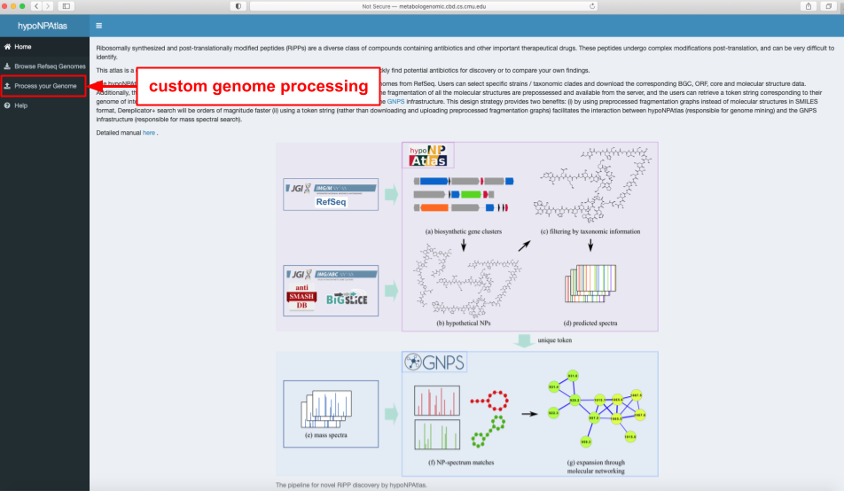
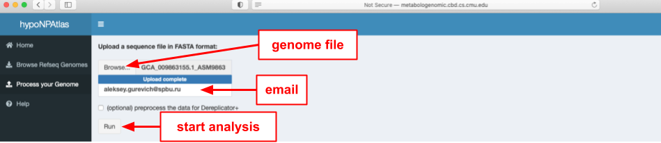
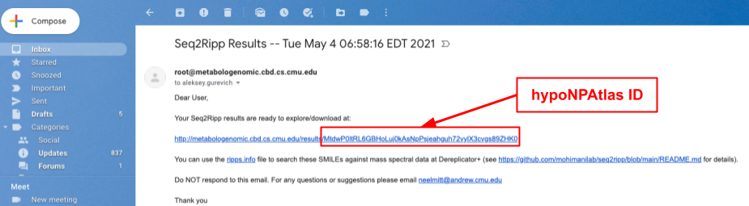
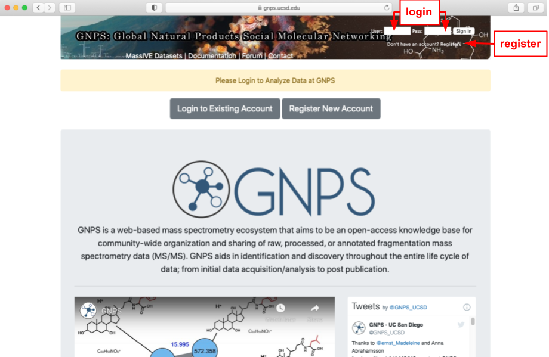
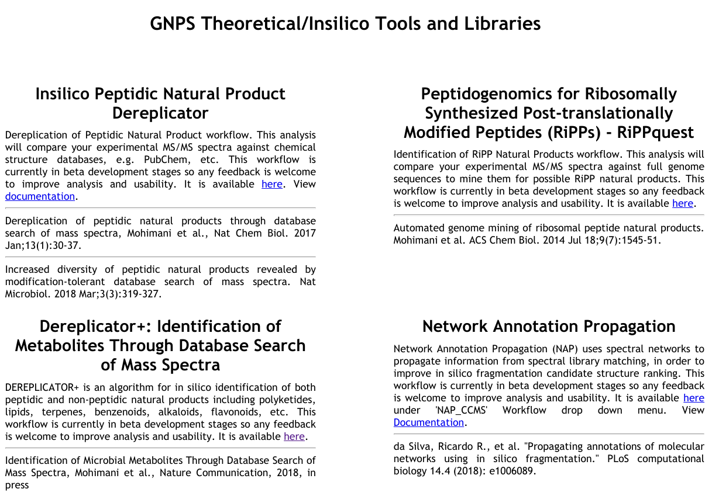
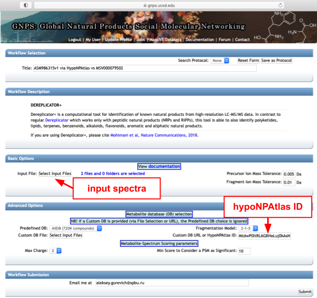
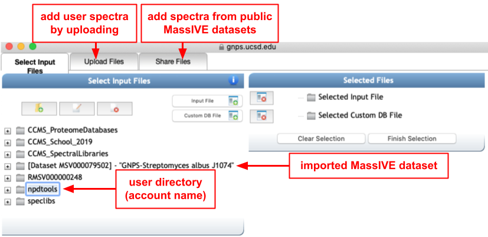
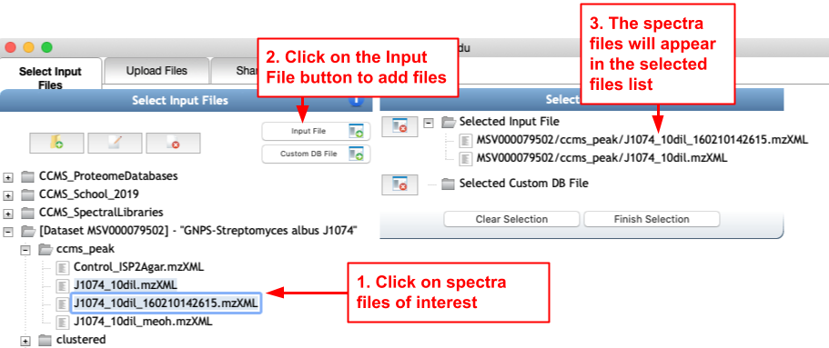
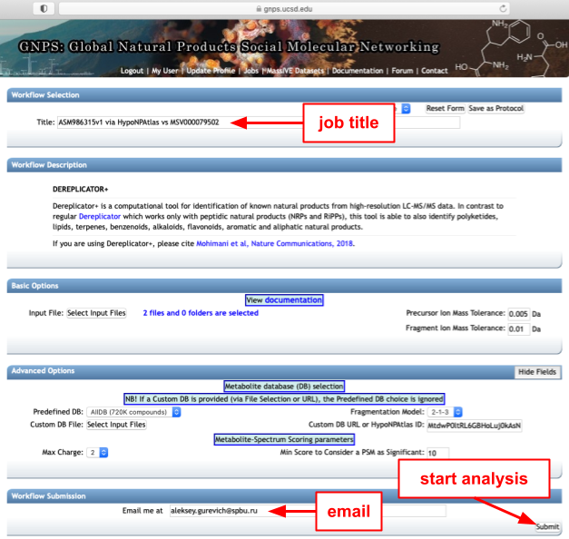

# HypoNPAtlas server
## Introduction
The [hypoNPAtlas](http://metabologenomic.cbd.cs.cmu.edu/AtlasofHypotheticalMolecules/) webserver currently includes hypothetical RiPPs from 22,671 complete microbial genomes from RefSeq. Users can select specific strains / taxonomic clades and download the corresponding BGC, ORF, core, and molecular structure data. Additionally, the hypoNPAtlas webserver supports the processing of input genomic data from users.  

All processed genomes are associated with a unique token string which one can use to search the predicted RiPPs against mass spectral datasets using [Dereplicator+](https://ccms-ucsd.github.io/GNPSDocumentation/dereplicator%2B/) from the [GNPS](https://gnps.ucsd.edu/ProteoSAFe/index.jsp) infrastructure. The use of a token string (rather than downloading and uploading predicted RiPPs) facilitates the interaction between hypoNPAtlas (responsible for genome mining) and the GNPS infrastructure (responsible for mass spectral search). Moreover, a user may request precomputation of the fragmentation graphs of all predicted molecular structures that make Dereplicator+ searches orders of magnitude faster.

## How to use your own data on the hypoNPAtlas server
To run the seq2ripp pipeline on your own data, please visit [hypoNPAtlas](http://metabologenomic.cbd.cs.cmu.edu/AtlasofHypotheticalMolecules). From there, navigate to the `Process your Genome` tab. Seq2ripp requires an input genome and email to run. Upon hitting the `Run` button, the genome will be read to look for any unknown characters or unreadable data.

* The homepage of the server. Navigate to the upload page by clicking the `Process your Genome` button in the sidebar.

* The upload page, where you can upload your genome and provide your contact email address. You may opt in for preprocessing the fragmentation of all identified RiPPs. If not selected, the resulting structures will be available in the SMILES format.

* This might take a few seconds to upload and clean the file. After it is done, the processing begins. It may take from several minutes to several hours depending on the server load and the size of the provided genome file. If the preprocessing for Dereplicator+ is selected, the overall computation could be much longer.

* When the processing is finished, you will receive an email from `root@metabologenomic.cbd.cs.cmu.edu` to the provided address. The email will include the link to download the predicted BGCs, ORFs, cores, and the molecules in the SMILES format. The 50-characters token in the link is a unique `hypoNPAtlas ID` which could be used on GNPS as explained in detail below.

## How to use hypoNPAtlas results on GNPS
The [GNPS](https://gnps.ucsd.edu/ProteoSAFe/index.jsp) platform allows uploading, sharing, and analyzing natural product mass spectrometry data (MS/MS) using various computational methods. We recommend searching your hypoNPAtlas results against one of the thousands of GNPS publicly available datasets or your own MS/MS data using the [Dereplicator+](https://ccms-ucsd.github.io/GNPSDocumentation/dereplicator%2B/) workflow. Below is a brief step-by-step instruction on using this GNPS workflow with hypoNPAtlas output. You may want to consult with the [Dereplicator+ documentation](https://ccms-ucsd.github.io/GNPSDocumentation/dereplicator%2B/) or [Mohimani et al., 2018](https://doi.org/10.1038/s41467-018-06082-8) to get more details. You may also be interested in trying the new [molDiscovery](https://ccms-ucsd.github.io/GNPSDocumentation/molDiscovery/) method, which has a very similar interface to Dereplicator+ but outperforms it in both efficiency and accuracy.

* Go to [https://gnps.ucsd.edu/](https://gnps.ucsd.edu/) and log in using an existing account or create a new one.

* From the main page, navigate down to the `Advanced Analysis Tools` section, and click the `Browse Tools` button in the `In Silico Tools` subsection.

* Click the link `here` in the Dereplicator+ section at the left bottom. Alternatively, you can use the [direct link](https://gnps.ucsd.edu/ProteoSAFe/index.jsp?params=%7B%22workflow%22:%22DEREPLICATOR_PLUS%22%7D) to the Dereplicator+ workflow. **NB**: you should be logged in to GNPS to properly open the link!

* In the `Advanced Options` section, insert your 50-characters token from the hypoNPAtlas email into the `Custom DB URL or hypoNPAtlas ID` field. In the Basic Options, you should select at least one MS/MS file as an `Input File`. Please, consult the [Dereplicator+ documentation](https://ccms-ucsd.github.io/GNPSDocumentation/dereplicator%2B/) regarding the rest Basic and Advance options or left them with the default values.

* The spectra selection window allows uploading of your spectra to the account folder or importing GNPS public datasets.

* To choose spectra file(s), select them in the left pane, click on the `Input File` button in the middle pane, and check the correctness of the selection in the right pane.

* When MS/MS data is selected, fill the rest mandatory fields (`Title` and `Email`) and start the analysis by pressing `Submit`

* After a few hours, you will receive an email from GNPS containing the link to the results. The processing time may vary significantly depending on the spectral dataset size and the number of predicted RiPPs. The resulting Dereplicator+ window looks like the following. Click on the `View All MSMs` report to view all significant Metabolite-Spectrum Matches identified in the dataset. Please, consult the [Dereplicator+ documentation](https://ccms-ucsd.github.io/GNPSDocumentation/dereplicator%2B/) regarding the rest types of reports.

## HypoNPAtlas implementation and technical details
The hypoNPAtlas was built using Shiny, an R package developed to simplify the complexities of typical back and front-end web development. Shiny requires two scripts, ui.R and server.R that control the appearance of the app and contain functionality needed to build the app, respectively. HTML, CSS, and Javascript can be added to both scripts to extend R functionality, and snippets of all three languages were used in areas where R lacked methods for a requirement, including loaders, view buttons, and row conditions within data tables. On the back-end, genomic data for BGCs, ORFs, cores, and RiPPs are separated by files. The architecture of hypoNPAtlas requires a one-to-one mapping of genomes to data directories. A directory containing 4 files, one for each type of sequence in the seq2ripp pipeline, maps to a single genome. HypoNPAtlas is hosted on an Ubuntu server at Carnegie Mellon University.

## Feedback and bug reports
If you have any questions regarding hypoNPAtlas/seq2ripp or wish to report a bug, please write to [hoseinm@andrew.cmu.edu](hoseinm@andrew.cmu.edu) or [post a GitHub issue](https://github.com/mohimanilab/seq2ripp/issues).
